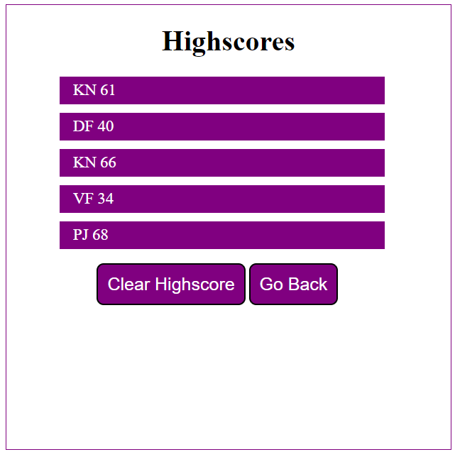

# Module 4 Web APIs Challenge: JSS Code Quiz

This project was designed as a homework assigment for UCI's coding bootcamp.

This is a quiz application featuring HTML, CSS and Javascript. This application emphasizes the use of JSS to provide quiz questions and collect user data to determine whether the answers to a question are correct, this then generates a score and reveals a final page of results with high scores from the user data. 

This project has been deployed to GitHub. It can be launched via the deployment link below. 

*[Github Repository](https://github.com/KevinNg2/JSS-Code-Quiz)
*[Deployed Github IO](http://127.0.0.1:5500/01-Class-Content/04-Web-APIs/02-Challenge/Assets/index.html)

### Prerequisites

I have provided a text editor using Visual Studio Code.

### Summary 
* HTML, CSS & JSS documents create a quiz with multiple choice questions with JSS Trivia
* This project emhasizes the use of JSS to make dynmamic changes to an HTML document
* This project features appending HTML pages as the user answers each question

### This Project Features:
* A Start Quiz Button
  * This starts a timer for the user
  * Each question averages 15 seconds each for a total time of 75 seconds + 1 second

 * An appended HTML page that features questions, and multiple choice answers
   * If questions are answered incorrectly, 5 seconds are deducted off remaining time
   * Answers are recording using an event listener, "click" and tracks correct answers

* Another appended HTML page that features:
  * Final score which is calculated using the time remaining
  * A Summary of how many questions the user answers correctly
  * An Input field to record users initials
  * A Submit Button
  * The Submit Button saves initials and score to local storage

* The last HMTL page that features Highscores
    * This is a list summary of users initials and final scores
    * The 'Clear Highscore' Button resets the page and local storage
    * The 'Go Back' Button returns to the start of the quiz

### Functionality
* Create a timer attached to a button with a starting value of 0
* When timer is pressed, start a reverse countdown from 75
* Create a 0 for countdown
* When countdown starts, start quiz
* Start Quiz will be appended page
* Append the question: choices
* When user selects the correct answer, textcontent "Correct!" appears
* When user selects the incorrect answer, textcontext "Wrong!" appears
* Final score will keep track of how many the user got correct
* Left over time will be deducted from final score
* Final Score Appended Page
* Captures local storage
* Travels to another HTML page
* Retrieved highscores

### This Project features scripts of: 
* Questions contained in an array variable with objects
* Variable declaration area
* An event listener (onclick) that generates a time interval
* A function to render the questions and choices on the page using a for loop
* An event listener on all list choices
* A comparison page showing the final stats of the users with input areas for their initials while capturing local storage
* Highscores are recorded to local storage

### Features:
* Two HTML Pages
  * Index.html
    * Landing Page to start timer
    * Appends five pages for each question
* Highscores
  * Retrieves local data from previous page
* CSS Page
  * Style.css
    * Centering and styling for html list features
    * Media Queries
* Two Javascript Pages
  * Variables with arrays with objects
  * Event Listeners
  * if/else statements
  * For Loops
  * Functions

### Authors
* Kevin Ng [Git Hub Profile](https://github.com/KevinNg2)
* The Coding Boot Camp at University of California Irvine Continuing Education 